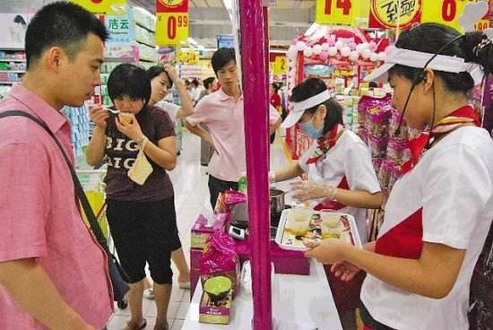
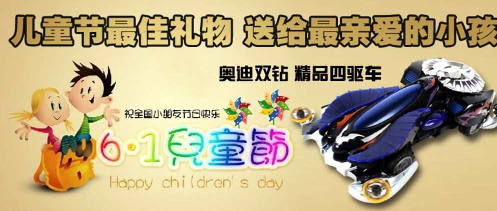
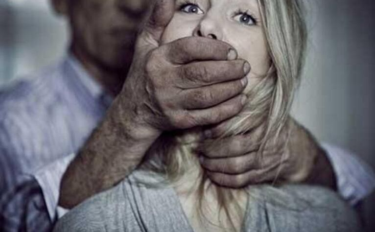
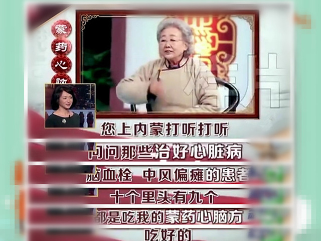
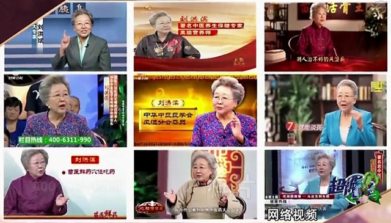
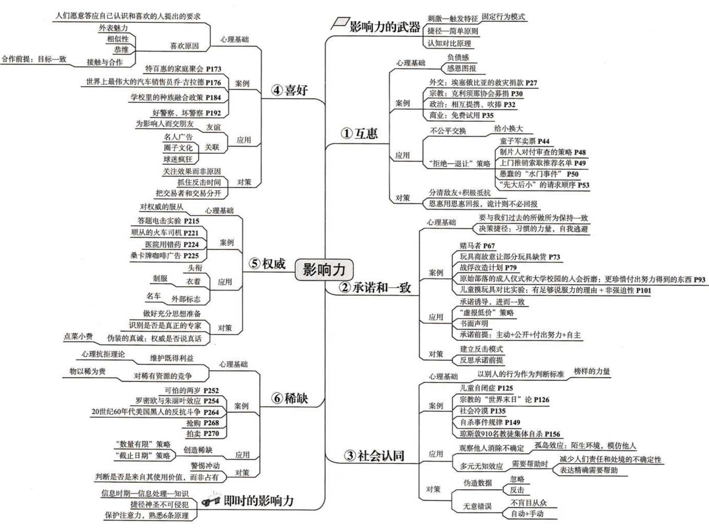

# 《影响力》\| 我们是如何被说服的？

> 导读：超市的酸奶区为什么经常有漂亮的小姐姐让大家试喝酸奶？为什么工作中的商业目标最好得到员工自己的认可？遇到危险的时候我们应该怎么去呼救才最有可能得到别人的帮助？电影里面审讯嫌疑犯的时候有一个好警察一个坏警察有什么科学依据吗？电视台上的老年保健品广告为啥都找老大妈讲什么“砖家讲座”？我是如何在“京东618”活动稀里糊涂的买了一个本来不想买的蓝牙耳机的？这一切问题的答案，都在《影响力》这本书里。

阅读时间：20分钟

第一次听说《影响力》这本书，是在参加公司组织的一个产品经理培训的课堂上，来自腾讯的产品讲师在第一节课就给我推荐了这本书。看到这个书名，我脑子里冒出来的第一个想法是：这不会又是一个贩卖成功学的鸡汤书吧？于是抽出一些碎片时间在微信读书上把这本书读了一遍，读完以后心里存在的疑惑就一扫而光了，这不仅不是一本鸡汤书，还是一本内容严谨、事例详实的社会心理学作品，所以将书中的内容整理归纳，好书共读，与你分享。

## 书籍介绍

本书的作者是美国著名的社会心理学家[**罗伯特·西奥迪尼**](https://baike.baidu.com/item/罗伯特·B·西奥迪尼/2897557?fromtitle=罗伯特·西奥迪尼&fromid=10963052)，全球知名的说服术与影响力研究权威，先后在于北卡罗来纳大学、哥伦比亚大学取得博士学位并从事博士后研究工作，曾在亚利桑那州立大学担任心理学教授执教多年，现为名誉退休教授。

原书写于1986年，获得过美国心理协会、美国心理学基金会年度大奖提名，于2010年首次翻译到国内，目前国内有多个翻译版本，推荐阅读“社科版”。[豆瓣评分：8.7分](https://book.douban.com/subject/5287474/)，阅读方式可以选择“微信读书”或者是下载PDF版本进行阅读。

在书中，作者从专业角度为读者阐释了顺从他人行为背后的六大基本原则：**互惠、承诺和一致、社会认同、喜好、权威和稀缺**，为我们解释了为什么有些人极具说服力，而我们总是容易上当受骗。

下面我将简单介绍这六大原则的内容，更详细的内容和更丰富的事例还请查看原书。

## 零、影响力的基础

《影响力》全书都在围绕着一件事情展开讨论：我们在什么情况下会表现的更加顺从？要想讨论清楚这个问题，还要从一个关键词开始说起：**固定行为模式**。

其实固定行为模式在生活中很常见，比如“孔雀开屏”，雄孔雀在野外环境碰到天敌的时候会开屏吓跑捕食者，但是在动物园中，当孔雀看到穿着艳丽的游客的时候，也会开屏并摩擦羽毛发出沙沙声进行示威和防御，这都是触发了孔雀的防御机制而带来的一系列有序的行为反应。有趣的是，触发这些行为的并不是对手这个整体，而是某个特征，比如艳丽的色彩。

更有趣的是，这种固定的行为模式在人类中也普遍的存在着，比如“价格贵=质量好”，在我们上网买一些贵重的商品的时候，同样的商品描述，我们更倾向于买价格高一些的商品，也是基于这个固定的行为模式。

这种固定的行为模式本身是没有错的，甚至我们可以说，就是因为有这些固定的行为模式，我们才能在信息越来越烦杂的社会上正常的生活，社会发展带来的知识大爆炸和信息大爆炸不允许我们再慢腾腾的一点一点的去分辨所有的事情，因此固定的行为模式可以帮助我们更有效率的处理事情，而且通常情况下，这样得到的结果也是很好的。

举个我自己的例子，上周我去“吉野家”吃饭，想吃猪肉饭，单点需要20元，套餐的话需要29元，多一杯可乐和小份土豆泥。因为想喝饮料，我不假思索的点了套餐。吃完饭以后我又看了一眼价格表，发现分开单点也是需要29元，点套餐并没有给我省钱！而在我的脑子里，点了套餐是一定比单点划算的，所以我就莫名其妙的多花了一份土豆泥的钱，而且我并不想吃它！但是这个“套餐=更划算”的固定行为模式在其他地方是生效的，可以帮我简化选择吃哪些这个难题，帮我节省了一些精力。所以，我决定以后再也不去这家店吃饭了！

总的来说，**因为在人类的发展过程中存在一些固定的行为模式，可以帮助人类更简单快速的做出更正确的决策，而有一些方法可以利用这些行为模式达到某些目的**，了解了这六大原则，你就知道生活中存在着哪些让你顺从的套路，之后也能从这些套路中安全抽身，甚至化为己用！

## 一、互惠原则

互惠原则非常简单，就是我给了你一些好处，你以后要找机会还回来。

中国社会其实就是牢牢建立在这种互惠原则上的，我们经常说的“人情往来”其实就是互惠原则的最佳体现。朋友家要结婚了，你要给随份子钱，你不用担心这钱给了回不来，除非是你这辈子打定主意不结婚了，否则等你结婚的时候，朋友一定会把份子钱再如数返回，甚至会更多。因为如果你不遵守这种社会规则，你就会被认为是“不懂人情”、“揩油鬼”、“忘恩负义的王八蛋”等标签，也就没人再原因和你做朋友了。

所以说，当你拿了别人的好处的时候，你会产生亏欠感，这时候如果别人想让你做什么事情，你就很难拒绝了。这就是互惠原则的最简单粗暴的利用。

还记得我在前面提到的那个问题吗？超市的酸奶区为什么经常有漂亮的小姐姐让大家试喝酸奶？

这里其实就是利用到了互惠原则\(当然，还有第四原则“喜好”，这个后面我们再谈\)，大家想去尝尝酸奶味道怎么样，大部分人是有购买的需求的\(当然，需要排除看到便宜就想占的个例😂\)，你试吃完以后，漂亮小姐姐会问你“味道怎么样呀”，要是真的不符合你口味还好，你可以直接说“一般般”，然后走开，毫无压力。

但是如果尝着还可以呢？你吃都吃了，味道又不错，要不要来一箱？如果不买一点的话，是不是心理会有一些亏欠和心虚：“漂亮小姐姐会不会以为我就是为了免费吃才过来的呀，会不会以为我是爱占便宜的小气鬼呀？而且我都免费吃了半盒了，不买点不好吧？”这个时候，迫使你去购买的心理压力和社会压力就来了，虽然并不是每个人都会在这种压力下就范，但是一定会有人因为这种压力而去购买。

除了上述生活中碰到的场景外，作者在书中描述了克利须那协会利用类似的手段提高募捐者的方式：先免费送给募捐者一朵花，然后再暴露自己募捐的真实意图，可以大大提高募捐的成功率，这种方式给他们带来了客观的收入，帮助教会扩张和发展。

互惠原则的原理非常简单，我们应该提防的是别人对这个原则的别有用心的两个使用。

### 应用：以小博大

实验证明，互惠原则并不总是等价交换，对于别有用心的人来说，可以打定主意通过给你小的恩惠，来操纵换取大的回报。一个很典型的例子就是在充满诱惑的夜店，如果一个陌生男人请一个女生喝酒吃饭，女生都默认同意了，走到最后一步要带她去酒店了，女生却说：“你什么意思呀？为什么带我去酒店？”那么我估计整个社会都会指责这个女的，“装什么装？绿茶婊”之类的话，因为在这个过程里男人有了金钱的付出，女生没有给予回报，这在社会准则上是不被提倡的，从接受第一杯酒的那一刻，就让男人有了一个可能的想法：我付出的这杯酒要以某种形式偿还回来。

### 应用：拒绝-后退术

这个方法也比较好理解，就是在于他人打交道的过程中，可以先提出一个对方可能不能接受的条件，然后再主动让步，提出真正想和对方达成的条件，来提高达到自己目的成功率。

这个是什么原理呢？

成员为实现共同的目标而一起努力，对任何社会群体来说，这都符合其利益。可在很多社会互动当中，参与者往往一开始就提出一些其他成员无法接受的要求或条件。因此，为了完成对社会有益的合作，整个社会必须设法解决这些互不相容的初始欲望。这就要借助有助于双方达成妥协的程序，互相让步是这类程序里非常重要的一种。

互惠原理通过两条途径来实现相互让步。**第一：它迫使接受了对方让步的人以同样的方式回应；第二条：由于接受了让步的人有回报的义务，人们就乐意率先让步，从而启动有益的交换过程**。归根结底，要是不存在回报让步的社会义务，谁乐意头一个牺牲利益呢？你有可能放弃了某种东西，却得不到任何回报。不过，有了互惠原理的影响，我们就可以安安心心地率先向合作伙伴让步了，因为他也有义务牺牲一些利益，以此回报我们的善意。

### 如何拒绝

**善意自然应当以善意回报，但是对于销售策略就没有这个必要。**所以当你下次再去超市的话，可以尝试一下免费试吃不买商品呀！

## 二、承诺和一致

第二种常见的影响力武器就是“承诺与一致”，道理非常简单，因为“**人人都有一种言行一致的愿望**”，所以一旦我们做出了许诺，那我们的行为就会按照许诺的那样去做。

其实这也是人类社会发展的必然结果：信仰、言语和行为前后不一的人，会被看成是脑筋混乱、表里不一，甚至精神有毛病的；另一方面，言行高度一致大多跟个性坚强、智力出众挂钩，它是逻辑性、稳定性和诚实感的核心。

作者在书中举了一个非常有意思的例子： 圣诞节之前，玩具厂商开始在电视上做一些特别玩具的广告，这些广告都很有意思。显然，孩子们想要这样的玩具，他们缠着父母答应圣诞节买来送给自己。好了，这些玩具公司的精明之处就在于：他们故意不给商店提供足够的货品。这下子，大部分当爹妈的会发现这些玩具早就卖光了，他们只好买下等值的其他玩具给孩子充数。当然了，对于这些充数的玩具，制造商们的货给得足足的。接着，过完了圣诞节，公司又开始为前面那些特别的玩具打广告，这使得孩子们越发想要了。他们跑去跟父母哭诉：‘你答应过的，你答应过的。’于是当爹妈的只好痛苦地跑去玩具店履行自己的诺言。

这上面这个例子中，就利用了父母给孩子的承诺，大人想给孩子做出“说到做到”的榜样，最终让父母买了两份玩具，增加了玩具的销量。

### 登门槛

这种影响力武器在销售中利用的更加普遍，比如第一笔生意再小也要做，因为我们的目的不是为赚钱，而是为了获得对方的承诺。一旦获得了对方的承诺，那更多的生意，自然会从这个承诺中源源而来。这种从小请求开始，最终要人答应更大请求的手法，叫做**“登门槛**”。

### 抛低球

除此之外，在销售中还经常有另外一种手法也值得我们注意：卖方会先给顾客一个甜头，诱使顾客作出有利的购买决定。而后，等决定作好了，交易却还没最终拍板，卖方巧妙地取消了最初的甜头，顾客最终因为之前的承诺，通常也会完成整个交易。

例如对于汽车销售来说，他们对某些客户提供十分优惠的价格，比如某款车的价格比竞争对手低上400美元。不过，这笔划算的交易可不是真的，经销商根本无意兑现，它的唯一目的是让潜在客户决定在本店买车。一旦客户作了决定，经销商就会采取一系列的活动，培养客户的个人承诺感——填写一大堆购车表，安排各方面的贷款条件，有时候，还鼓励客户试驾一整天的车，之后再签合同，“这样你就有了拥有这辆车的感觉，还开着它给邻居和同事看了”。经销商知道，在此期间，客户一般会找出大把的新理由来支持自己的选择，证明自己的投资很划算。

之后便会发生一些事情。有时，销售员会在计算中发现一个“错误”——比如忘了把空调算到成本里，倘若买家还是要空调，那就得把400美元重新加到价格当中。为了撇清自己的嫌疑，有些经销商会让银行批贷款的工作人员发现错误。还有些时候，到了最后关头交易突然被驳回了——销售员跟老板汇报工作，老板唱了黑脸：“这样子卖车会亏钱的。”买一辆车要好几千甚至上万美元，多上400美元似乎没那么肉疼，再说了，销售员会强调，价格跟竞争对手是一样的：“这可是你选的车呀，对吧？”

这个手法在中关村电脑城经常被使用，电脑销售会先给你推荐一款看着特别划算的型号，让你承诺购买，但是到了真正去拿货的时候，却被告知那一款已经没有货了，于是就推荐给你一款其他品牌的电脑，但实际上这台电脑并不划算，但是因为之前的承诺，来自内部和外部的压力让你硬着头皮买了下来，结果回到家才发现被骗了。

另外在工中确定一些商业目标的时候，最好的办法就是管理者和员工一起确立目标，员工对于自己定下来的目标的认可程度和完成度都会比较好。自己定下的目标，咬着牙也得努力去完成呀，要不然这种言行的不一致就会影响到你的仕途呀！

### 如何拒绝

**尽管保持一致一般而言是好的，甚至非常关键，但是我们也应该避免愚蠢的死脑筋。**

## 三、社会认同

社会认同原理是指“**在判断何为正确时，我们会根据别人的意见行事**”。

仔细想一想你最近几次在网上买一些你不太了解的商品时，你是怎么做出选择的？是不是看着哪个商品买的人多就选择哪个？再想一想当你去一个陌生城市出差，来到一条小吃街，你是不是会选择人比较多的一家试试？其实这种“买的人多=质量好”、“吃的人多=好吃”通常情况下是正确的行为模式，这种固定行为模式可以帮我们节省自己去花时间甄别的精力消耗，而且还能带来不错的结果。

还记得我在上面提到的一个问题吗：遇到危险的时候我们应该怎么去呼救才最有可能得到别人的帮助？

心理学家经过对一些奇怪的凶杀案的研究发现，当在公众场合发生这种紧急情况时，如果现场有大量旁观者在场时，那么旁观者对紧急情况伸出援手的可能性是最低的，这是什么原因呢？

原因至少有两个。

第一个原因很浅显，周围有其他可以帮忙的人，单个人要承担的责任就减少了，“说不定其他人会帮忙或打电话，说不定其他所有人已经这么干了。”因为人人都想着会有别人帮忙（或者别人已经帮了忙），结果人人都没帮忙。

第二个原因从心理学的角度来看更有意思，它建立在社会认同原理之上，并涉及到**多元无知效应**。很多时候，紧急情况乍看起来并不会显得十分紧急。倒在小巷里的男人，是心脏病发作了，还是只是喝醉了酒？隔壁的喧闹是需要报警的暴力打斗，还是只是夫妻俩在吵吵闹闹，外人干涉不必要也不恰当？到底是怎么回事？碰到这种不确定的情况，人很自然地会根据周围其他人的行动来加以判断。我们可以根据其他目击者的反应方式，得知事情到底够不够紧急。

可我们很容易忘记，其他旁观该事件的人恐怕也正在寻找社会证据。因为我们所有人都喜欢显出一副镇定自若、从容不迫的样子，我们可能只是暗中瞟着周围的人，不动声色地寻找证据。这样一来，在每一个人眼里，其他的人全都是镇定自若的，没打算采取什么行动。于是，在社会认同原理的作用下，人们觉得这起事件没什么紧急的。这就是所谓的“多元无知”状态：“每个人都得出判断，既然没人在乎，那就应该没什么问题。

### 如何有效求救？

让我们再回到一开始的问题，我们应该如何求救才能提升被帮助的几率呢？

在需要紧急救助的时候，你的最佳策略就是减少不确定性，让周围人注意到你的状况，搞清楚自己的责任。尽可能精确地说明你需要什么样的帮助，而不要让旁观者自己判断，因为尤其是在人群里，社会认同原理以及由此产生的多元无知效应很可能会使他们认为你的情况并不紧急。在本书提到的所有顺从技巧里，这一条恐怕最为重要，必须记住。毕竟，要是没得到紧急救助，你说不定就没命了。

### 如何拒绝

有些商家利用“社会认同原理”来影响我们的购买决策，比如淘宝上的商家会刷好评和销量，来让我们觉得大家都在买某一款商品；还有的电视广告，会找演员假装成普通人来说服我们，好像和我们一样的普通人也都在用他们的商品。

那么我们如何避免受到“社会认同原理”对我们产生的消极影响呢？

北美野牛是一个神奇的物种，特别容易受社会证据的误导，因为它们有两个特性：一是它们的眼睛长在头部两侧，所以它们总是容易往两边看，而不是往前看；二是它们跑起来的时候脑袋是低着的，所以看不到前面出了什么情况。于是，印第安人意识到，只要把牛群往悬崖边上赶，就有可能猎到数量庞大的野牛。一旦这种动物对身边的“社会认同”作出响应——却从来不曾抬起头来看看前面到底有些什么，他们就大功告成了。曾有人对这种猎牛法做过观察，描述了野牛过分信任集体智慧的致命后果：通过这种办法，人能把牛群骗到悬崖边上，让它们一起跳下去。领头的牛是被后面的牛顶下去的，其余的牛则是自愿跳下去的。

显然，就算飞机上装着自动导航仪，飞行员最好还是偶尔看看仪表盘和窗外。**同样道理，在我们采纳群体证据时，有必要周期性地四处看看。**面对误导的社会认同，不使用这种简单的防护措施，我们很可能会跟北美野牛落得一个下场：跌落悬崖。

## 四、喜好

人们总是愿意答应自己认识和喜爱的人提出的要求，这是很自然的事情，那么什么样的人会得到我们喜爱呢？

1. 长得好看的人
2. 和我们类似\(观点、个性、背景、生活方式、兴趣、宗教信仰、政治观点\)的人
3. 称赞我们的人
4. 和我们一起为了一个目标努力的人
5. 和我们喜欢的元素有关系的事物

所以说有的销售人员在向我们推销商品的时候，会特意和客户闲聊，找一些相似点，比如说老家是一个地方的，或者是家里父母的工作是类似的，然后趁机奉承一下客户，比如说“哎呀，那你现在做到这个程度真是不简单啊！”谁不喜欢听好话呢？所以打扮的帅帅的，找到和客户的共同点，然后真诚的称赞，让客户喜欢上你，这生意就算是成了一半了。

另外，现在的Android智能手机领域，VIVO和OPPO是打偶像派打的最厉害的手机品牌，在非一线城市抢占了很大的市场份额，我觉得一个很重要的原因就是找了一些年轻人喜欢的偶像做代言，长的好看的偶像会有“光环效应”，我们会自动的给好看的人打上“优秀”、“善良”、“聪明”、“诚实”的标签，我们就会把这种印象和品牌结合起来，增加对某个品牌的好感，从而促进我们的购买行为。

还记得在电影里面看到的好警察和坏警察一起审讯嫌疑犯的情节吗？好警察/坏警察的做法之所以管用，有若干原因：靠着坏警察的威胁，嫌犯的心里很快就注满了对长期监禁的恐惧情绪；知觉对比原理也发挥了作用，相较于满嘴胡言乱语的坏警察，好警察显得像是个特别讲道理的好人；又因为好警察屡次帮嫌犯说话，甚至还自己掏钱为嫌犯买咖啡喝，互惠原理令嫌犯感到了压力，让他想要回报好警察的好意。**然而，这种刑讯手法见效的主要原因在于它让嫌犯感觉有人站在自己这一边，有人为自己着想，有人愿意跟自己合作。**就算在正常的环境下，这样的人也会显得特别好心肠。更何况此时抢劫嫌疑犯陷入了大麻烦，这样的人简直就是大救星了。用不了多久，在嫌犯眼里，好警察就会从大救星变成值得信赖的告解神父，连所做的坏事都可以向他忏悔了。

### 如何拒绝

那么我们如何拒绝有人会利用我们的喜好，来影响我们的行为呢？一个最直接的做法就是在我们做决策的时候，要把销售者和我们要买的商品分开来。仔细想一下，这个家伙确实挺招人喜欢的，但是他卖给我的东西是不是我需要的？值不值这个价钱？我们总不能老是因为喜欢某个家伙，而买他的东西吧？当然，你要是故意想和他套近乎，搞对象的话就另说~

## 五、权威

我们天生对权威会有一种顺从的习惯。

从小的时候，我们就被教育在学校要听老师的话，在家里要听父母的话。长大以后，工作要听领导的话，去政府部门办事情要听公务员的话，去医院要听医生的话。

“父为子纲，夫为妻纲，君为臣纲”，这样的多层次权威体制有利于维持社会的控制，防止出现无政府状态，但是一旦“权威”被滥用的时候，也会出现很多问题。

那么哪些因素会让人产品权威性呢？主要有以下三个因素：

1. 头衔
2. 衣着
3. 外部标志

你可在电视上见过这个老太太？

看着是仙风道骨\(衣着\)，自称是蒙古医生\(头衔\)，然后还在电视机上和大家宣传她祖传的蒙药秘方，其实就是利用权威性来说服电视机前的老年人买保健药。

### 如何拒绝

如何避免权威性对自己的影响呢？那就是要确认权威的资格以及这些资格和眼前的主题是否相关。

就拿刚才的例子来说，这个老太太不只是蒙医，还在其他的广告中宣称自己是苗医、类风湿专家、失眠专家，根本就是商家找来的一个演员，不能因为她看着好像很权威的样子，避免上当受骗。

另外一个例子，很多歌唱类选秀类节目的评委只是电影演员，在歌唱领域没有什么发言权，但是却因为名气比较大所以被选为评委，像这种就属于权威的资格和与主题不相符，没有必要对他们的评价言听计从。

当然，去医院看专家号的时候，就老老实实的听从医生的安排吧！

## 六、稀缺

机会越少，价值就越高，害怕失去某种东西的想法比希望得到同等价值东西的想法对人们的激励作用更大。

在前段时间京东”618“活动的时候，我稀里糊涂的就买了一个蓝牙耳机，但其实我一直没有买蓝牙耳机的计划，这是为什么呢？

起因在于，在某一天晚上我收到京东客户端的一个Push，告诉我电子产品在搞活动有特价，于是我九点了进去，活动页最上面有个蓝牙耳机，原价299，活动价只要79\(对比原理\)！限时特价，只此一天\(稀缺原理\)！马上就勾起了我的购买欲望，要是今天不买，我就要多花220块钱啊\(对亏损更敏感\)！但是我对蓝牙品牌了解很少，于是我就去了解了一下这个品牌的蓝牙，发现评价很一般，购买的欲望就减少了一半，这时，京东送了我一张满299减100的耳机优惠券！而且有效期只有5天\(限时稀缺性\)，买电子产品的冲动又上来了！于是我去看了下符合要求的耳机，然后按照销量比较多的选择了一款\(社会认同原理\)就下了单。

恩，耳机到了以后，试用了一会j就后悔了，哪个牌子？漫步者，以后不会再买这个牌子的耳机了...

### 如何拒绝

首先，一旦在顺从环境下体验到高涨的情绪，我们就可以提醒自己：说不定有人在玩弄稀缺手法，必须谨慎行事！特别是现在的各种网购的活动！

其次，在这样的情况下，我们务必记住：稀缺的东西并不因为难以弄到手，就变得更好吃、更好听、更好看、更好用了。我买的蓝牙耳机就是一个深刻的教训！

## 七、总结

总的来说，《影响力》这本书是一本非常有意思的书，作者总结了我们在那些情况下容易被说服，而且有很多有意思的例子，但是我觉得，这本书更大的价值在于，让我更了解了作为人这一个奇特的生物有这么多神奇的特点，这些特点的初衷其实都是为了让我们更快更好的适应生活的节奏，只不过这些特点在某些时候也会诱导我们做出顺从的反应，以后再遇到这些容易顺从的场景的时候，一定要警惕哦！

最后附上一张思维导图

作者：凯子哥

版权声明：著作权归作者所有。商业转赞请联系作者获得授权，非商业转载请注明出处。

