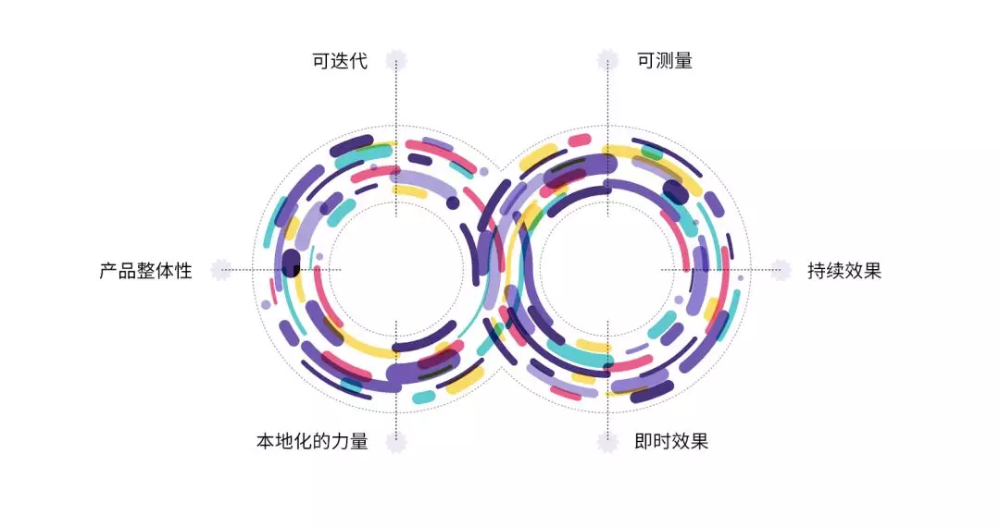

# 如何处理领导提出的奇葩想法

### 六维验证法

1. 必须是可以迭代的。我们能够从一个简单的 MVP 开始不断迭代直到完善；
2. 有立竿见影的效果。当新的想法实现的时候需要能给我们带来直观的改变；
3. 有长远的效果。这个想法需要能在长期帮助我们的用户，而不是三分钟热度；
4. 必须可以量化。我们需要可以量化产品对用户的影响；
5. 可以本地化，能够尽量覆盖大量的应用市场；
6. 和产品相关，并且是可以理解的。

### 相关资料

1. [顶尖开发者们的实战分享：如何有理有据地做产品决策](https://mp.weixin.qq.com/s/qbI9q5YZYwImIIXH1sej3w)

